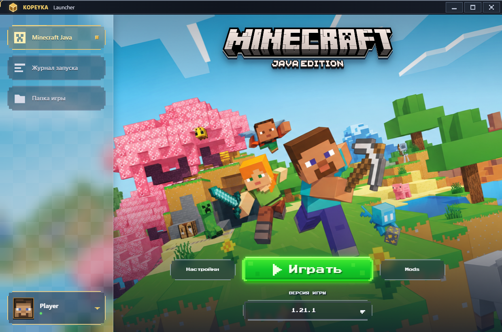

# KOPEYKA Laucher

Первый Windows x64 лаунчер Minecraft Java с офлайн-профилем и собственным пиксельным интерфейсом.

## Скачать для Windows

[Установщик 0.2 Beta](https://github.com/Arab228d/kopeyka-launcher/releases/download/v0.2.0-beta/KOPEYKA-Laucher-Setup-0.2.0-beta.exe) · [Все релизы](https://github.com/Arab228d/kopeyka-launcher/releases)

Текущая версия — **0.2 Beta** (`0.2.0-beta` в файлах сборки). Это предварительный релиз.

Поддерживается Windows x64. EXE устанавливает лаунчер для текущего пользователя в один шаг и создаёт ярлыки на рабочем столе и в меню «Пуск». Включены Electron и Eclipse Temurin Java 8, 16, 17, 21 и 25 с лицензиями. Отдельно устанавливать Node.js или Java не нужно. Файлы Minecraft и загрузчиков скачиваются при первом запуске: нужен интернет. Для других поколений игры Java при необходимости загружается автоматически.



## Запуск

Установите Node.js, затем выполните в папке проекта:

```powershell
npm install
npm start
```

Создать EXE-установщик со встроенными зависимостями:

```powershell
npm run build
```

Готовый файл находится в `dist/`. Для запуска EXE Node.js не нужен.

Создать установщик Windows x64 в один шаг с ярлыками:

```powershell
npm run build:installer
```

Установщик: `dist/KOPEYKA-Laucher-Setup-<версия>.exe`. При удалении лаунчера игровые файлы и настройки сохраняются.

Сборка автоматически готовит Java из `build/runtime-lock.json`, проверяет SHA-256 и запуск каждого `java.exe`. Архивы и распакованные зависимости кешируются в игнорируемых каталогах `build/`. Лицензии Java включаются без изменений. Для переносимой версии используйте `npm run build:portable`.

## Что работает

- Список релизов из официального каталога Mojang, с локальным кешем. В настройках отдельно включаются snapshots/pre-release и исторические Alpha/Beta/Classic.
- До 15 локальных профилей с разными никами: создание, переключение, переименование и удаление через карточку игрока. Это локальные профили, без Microsoft-авторизации. Настройки сохраняются.
- Общий выбор версии и загрузчика под «Играть»; «Настройки» слева, «Mods» справа. Доступность загрузчиков зависит от выбранной версии игры.
- Автоматическая загрузка Eclipse Temurin Java нужной версии с проверкой SHA-256.
- Установка vanilla Minecraft через minecraft-launcher-core и запуск офлайн-профиля.
- Загрузка клиента, библиотек и ресурсов с серверов Mojang; проверка SHA-1, повтор неудачного скачивания до трёх раз и повторное использование проверенных файлов. Отдельный ключ API для загрузки не нужен.
- Индикатор загрузки, журнал текущего запуска и файл `launcher.log` в папке данных приложения.
- Вкладка Mods: импорт локальных JAR-файлов и включение/выключение модов. Каталог Modrinth временно убран из интерфейса.
- Установленные моды показывают встроенные иконки JAR и сохранённые изображения.
- Vanilla, Forge, Fabric и OptiFine. Forge и Fabric устанавливаются автоматически при первом запуске. OptiFine скачивается пользователем с optifine.net и выбирается во вкладке Mods, затем устанавливается лаунчером.
- Фон с движением от мыши и синхронным размытием боковой панели; плавные переходы и ступенчатые углы элементов интерфейса.
- Пиксельные панели, настройки и собственная верхняя панель окна с кнопками свернуть, развернуть и закрыть.
- После «Играть» фон приближается и становится серее, появляется «Загрузка игры». Движение от мыши сохраняется. После сигнала готовности игры лаунчер скрывается и закрывается, а Minecraft продолжает работать.

## Дизайн и 3D-сцена

Сцена создаётся кодом в `src/scene/scene.js` и `src/scene/minecraft-world.js` с помощью Three.js. У неё полные кубические блоки, дубы с кроной из блоков, цветы на пересекающихся плоскостях и Стив с развёрткой скина 64×64. Вода анимируется кадрами игровой текстуры. Заголовок использует логотип из клиента, а Копейка — пользовательский золотой PNG из `src/ui/assets/kopeyka-logo.png`.

Фон и логотипы находятся в локальных ресурсах интерфейса. Фоновая картинка движется от мыши вместе с изображением под размытием боковой панели. Обновления ограничены 60 FPS и останавливаются после завершения движения или скрытия окна. Настройка уменьшения движения отключает декоративные анимации. Исходник старой 3D-сцены сохранён для разработки, но в интерфейсе и сборке не используется.

Загрузка использует четыре соединения и три попытки с паузами. После сетевой ошибки повторный запуск продолжает установку с проверенных файлов. Java распаковывается в рабочем потоке и проверяется до использования; размер памяти ограничивается доступной RAM. Кнопка «Сохранить журнал» сохраняет подробности установки и запуска для диагностики.

Сейчас используется одна сцена Overworld для всех версий. Отдельные диорамы обновлений (Незер, сакуры и другие) пока не реализованы. Для них можно добавлять отдельные функции создания сцены или позже подключить модели GLB.

Для первой установки нужен интернет. Java и игра скачиваются отдельно при первом запуске. Microsoft-вход, автообновление и подпись EXE пока не реализованы. Офлайн-профиль не позволяет подключаться к серверам, требующим официальную авторизацию. Лаунчер не связан с Mojang или Microsoft. Игровые файлы в EXE не включены.

Модовые сборки хранятся отдельно: `profiles/<версия>-<загрузчик>/` внутри выбранной папки игры. В каждой свои моды, настройки и миры; клиент и библиотеки используются из общей папки. Для локальных файлов пользователь выбирает подходящий JAR самостоятельно. Моды нельзя изменять во время работы Minecraft. При конфликте версии установленной зависимости операция останавливается, существующий файл сохраняется.

Исходники: `src/main.js` — окно и операции; `src/engine.js` — Java и каталог версий; `src/ui/` — интерфейс; `src/config.js` — проверка настроек.

## Загрузка Minecraft

Выберите версию и нажмите «Играть». Лаунчер сначала проверит и скачает её файлы, затем подготовит Java и запустит игру. Файлы берутся из `https://piston-meta.mojang.com/mc/game/version_manifest_v2.json` и ссылок в метаданных версии; авторизация для этих скачиваний не используется. Процент во время установки показывает число обработанных файлов, а не скачанные байты. Прерванная загрузка не помечается как завершённый файл; при следующем запуске исправные файлы используются повторно, остальные скачиваются заново.

`src/installer.js` выполняет загрузку и проверку файлов. `node test-launch.cjs` проверяет реальную установку и запуск 1.21.1; `KOPEYKA_TEST_ROOT` позволяет указать отдельную папку для проверки, используя общий кеш ресурсов. Тесты загрузчика проверяют повтор при повреждении, работу кеша и сетевые ошибки.

## Проверки

`npm test` проверяет настройки и лимит профилей, офлайн-UUID, загрузки, зависимости модов, изоляцию сборок, импорт JAR и обновления прогресса. `npm run test:ui` проверяет профили, общий выбор версии и загрузчика, движение фона и изменение размытия, логотипы, расположение кнопок, размеры окна, Mods и переключатели исторических/тестовых версий на заглушках API. Снимки и результат сохраняются в `artifacts/`. Эта проверка не скачивает и не запускает Minecraft.

`node test/loader-integration.cjs fabric` (либо `forge`, `optifine`) проверяет реальную установку и запуск 1.21.1 в отдельной папке `artifacts/`. Fabric также проверяется с Mod Menu и обязательными зависимостями. Проверка OptiFine скачивает оригинальный JAR с сайта автора только в папку теста; он не входит в EXE.

Для снимка настоящего интерфейса можно передать абсолютный путь PNG через переменную `KOPEYKA_SCREENSHOT` и запустить `npm start`: приложение сохранит снимок и закроется.

